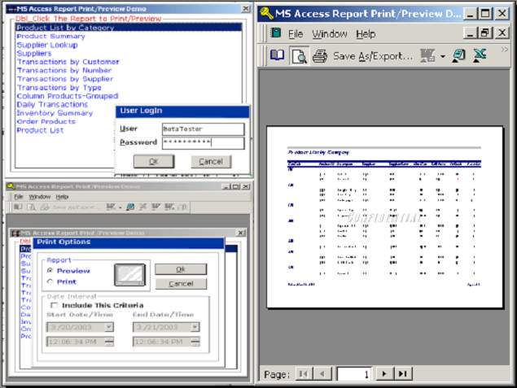



## Print & Preview MS Access Report In VB\(\*\.mdw Protected Database\)

### Description

This project will show you how to utlize MS Access as your report generator.

If you are tired of designing your report using other third party report generators

and if you want to create dynamic reports without making major revisions of

your app, then perhaps this project can help you.

Be sure to reference the MS DAO library, MS ADO Library and MS Access

Object library. If you have comments, email me.If you like it, then vote.

Use the following:

Username: BetaTester

Password: BetaTester
 
### More Info
 

             |
---                |---
**Submitted On**   |2003-03-20 20:17:28
**By**             |[Erick Asas](https://github.com/Planet-Source-Code/PSCIndex/blob/master/ByAuthor/erick-asas.md)
**Level**          |Beginner
**User Rating**    |4.0 (24 globes from 6 users)
**Compatibility**  |VB 5\.0, VB 6\.0, VBA MS Access
**Category**       |[Databases/ Data Access/ DAO/ ADO](https://github.com/Planet-Source-Code/PSCIndex/blob/master/ByCategory/databases-data-access-dao-ado__1-6.md)
**World**          |[Visual Basic](https://github.com/Planet-Source-Code/PSCIndex/blob/master/ByWorld/visual-basic.md)
**Archive File**   |[Print\_&\_Pr1562843222003\.zip](https://github.com/Planet-Source-Code/erick-asas-print-preview-ms-access-report-in-vb-mdw-protected-database__1-44172/archive/master.zip)

